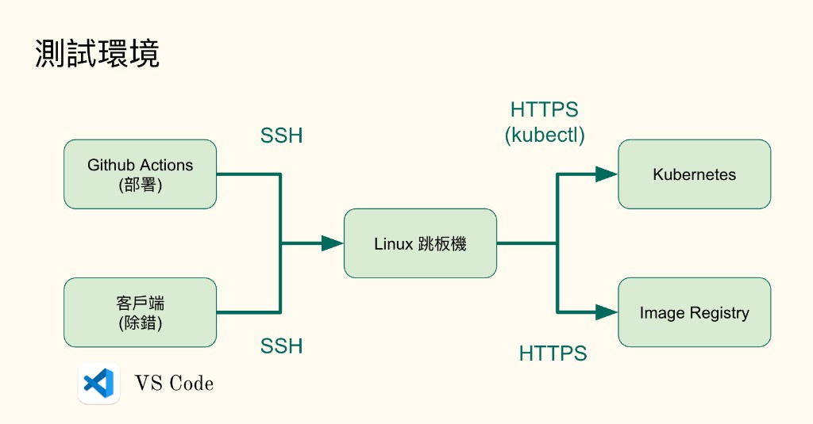
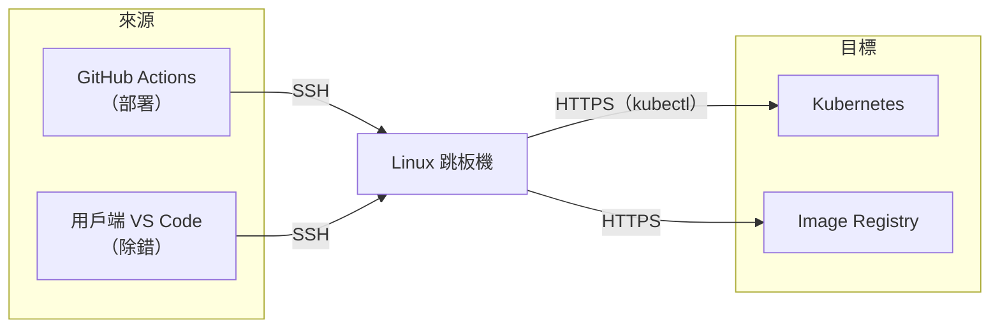
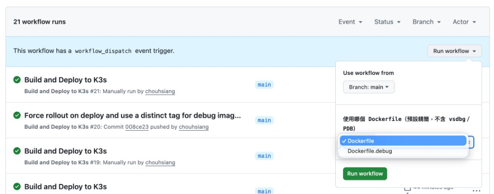

# K8s 上 .NET 遠端除錯計劃書

| 項目 | 內容 |
|------|------|
| 專案 | [dotnet-dotnet-k8s-debug](https://github.com/zeroflare/dotnet-dotnet-k8s-debug) |
| 目標環境 | **Kubernetes（K3s）上的 .NET 10** 應用（容器內執行） |
| 除錯方式 | Microsoft **vsdbg** + `kubectl exec`（stdio／DAP），**不開**除錯 TCP port |
| IDE | Visual Studio Code + Microsoft C# 擴充（`launch.json`） |

---

## 1. 目標與範圍

### 1.1 要達成什麼

- 日常部署維持精簡、可上線的映像（無除錯工具）。
- 需要下斷點、改區域變數時，改部署「除錯映像」，在本機 VS Code attach 到 **K8s Pod 內的 `dotnet` 程序**。
- **核心原理：本機除錯器必須能進入 K8s 容器**（經 **SSH → 跳板機** → `kubectl exec -i` 啟動容器內 `vsdbg`），在容器內與執行中的 .NET 程序對話；不額外暴露除錯 TCP port。

### 1.2 方案對照：舊方案 vs 新方案

| | **msvsmon.exe** | **vsdbg**（本計劃） |
|--|------------------------|---------------------------|
| **目標** | ❌ 僅 Windows | ✅ Linux／Windows（K8s Linux 容器適用） |
| **原理** | TCP 網路連線 | **需進入執行環境**再除錯 |
| **除錯工具** | Visual Studio | Visual Studio Code |
| **Port** | 需要開 Port | **不需開 Port** |

本計劃採用 **vsdbg**：適合在 Linux 容器內的 .NET，並透過進入容器除錯，無需對外開 debugger port。

### 1.3 什麼是 vsdbg

**vsdbg** 是 .NET 的命令列除錯器。可 attach 到正在執行的 .NET 程式，進行下斷點、檢查變數、查看 Call Stack、控制執行流程等。

要用 vsdbg 成功除錯，需同時滿足：

1. **容器內有 vsdbg** 執行檔（本計劃由 `Dockerfile.debug` 安裝到 `/vsdbg`）。
2. **容器內有 `.pdb` 符號檔**（與 DLL 同源，本計劃一併建進除錯映像）。
3. **VS Code 除錯環境能連進容器**（本計劃：SSH 到跳板機 + `kubectl exec`）。

---

## 2. 測試環境架構

測試／除錯相關流量都先到 **Linux 跳板機**，再由跳板機存取 Kubernetes 與映像庫。





| 路徑 | 協定／工具 | 用途 |
|------|------------|------|
| GitHub Actions → 跳板機 | **SSH** | 建置後部署（推 image、kubectl apply） |
| 用戶端 VS Code → 跳板機 | **SSH** | 遠端 attach（pipeTransport） |
| 跳板機 → Kubernetes | **HTTPS（kubectl）** | 操作叢集、`kubectl exec` 進容器 |
| 跳板機 → Image Registry | **HTTPS** | 推送／拉取容器映像 |

本機與 Actions **都不直連** Pod；一律經跳板機。

---

## 3. 兩個 Dockerfile

| 檔案 | 用途 | 建置 | vsdbg | PDB | Image tag |
|------|------|------|-------|-----|-----------|
| **`Dockerfile`** | 預設／日常 | Release | 無 | 無（並刪除殘留 `.pdb`） | `<commit-sha>` |
| **`Dockerfile.debug`** | 遠端除錯 | Debug + portable 符號 | **有**（`/vsdbg`） | **有**（與 DLL 同一次 publish） | `<commit-sha>-debug` |

### 2.1 預設 `Dockerfile`

- 正常編譯、正常執行。
- 不安裝 curl、vsdbg；不保留 PDB。
- `push` 到 `main` 時 GitHub Actions **自動**用此檔部署。

### 2.2 除錯 `Dockerfile.debug`

- `dotnet publish -c Debug`，並產生 **Portable PDB**（與 DLL 同源，斷點才能綁定）。
- 安裝 **vsdbg** 到 `/vsdbg`（供 IDE attach）。
- 保留 `/app/MyApi.pdb`。
- 僅在 **GitHub Actions 手動執行** deploy 時選用。

> PDB 必須與執行中的 DLL 來自**同一次 publish**。`Dockerfile.debug` 一次建進映像，避免事後重編 PDB 對不上。

---

## 4. GitHub Actions：手動跑 debug 映像

Workflow：`Build and Deploy to K3s`（`.github/workflows/deploy.yml`）

| 觸發 | 使用的 Dockerfile |
|------|-------------------|
| `push` → `main` | 固定 `Dockerfile`（精簡） |
| **Actions → Run workflow**（手動） | 下拉選 `Dockerfile` 或 **`Dockerfile.debug`** |



### 4.1 手動部署除錯映像步驟

1. 開啟 repo → **Actions** → **Build and Deploy to K3s**。
2. 按 **Run workflow**。
3. **dockerfile** 選 **`Dockerfile.debug`**。
4. 執行，等待 build／push／`kubectl apply` + `rollout restart` 成功。
5. 確認 Deployment image 為 `localhost:5000/my-app:<sha>-debug`。

切回一般環境：再手動 Run，選 `Dockerfile`（或 push `main` 自動部署）。

### 4.2 為何要 `-debug` tag 與 rollout restart

- 同一 commit 精簡／除錯映像內容不同，tag 分開（`<sha>` vs `<sha>-debug`）避免覆蓋混淆。
- 同一 tag 重推時 `kubectl apply` 可能顯示 **unchanged**；workflow 在 apply 後會 **`kubectl rollout restart`**，確保 Pod 拉新映像。

---

## 5. 除錯架構：進入 K8s 容器

原理不是「本機直接連 Pod 的某個 debug port」，而是：

**本機 VS Code → SSH 登入跳板機 → 在跳板機上 `kubectl exec -i` 進入應用容器 → 執行 `/vsdbg/vsdbg` → attach 容器內 `dotnet`。**

因此前提是：跳板機上的帳號對叢集有 **`pods/exec`** 權限，且容器內已有 vsdbg（本計劃用 `Dockerfile.debug` 帶入）。

```text
本機 VS Code（F5 / Attach）
        │  pipeTransport：ssh（金鑰、帳號、主機）
        ▼
跳板機（Bastion / Jump Host）
        │  其上已設定好 kubectl，可操作 K8s
        │  kubectl exec -i deploy/my-app-deploy -c my-app --
        ▼
應用容器（K8s Pod）
        ├── /vsdbg/vsdbg      ← 除錯器（在容器內跑）
        ├── /app/MyApi.dll   ← 執行中的 .NET 程式（通常 PID 1）
        └── /app/MyApi.pdb   ← 同源符號
```

| 角色 | 說明 |
|------|------|
| **跳板機** | `launch.json` 裡 SSH 的目標（例：`github@<SSH_HOST>`）；本機不直連 Pod |
| **kubectl** | 跑在跳板機上，負責進入目標 Deployment／容器 |
| **應用容器** | 真正執行 .NET 與 vsdbg 的地方 |

HTTP 的 port-forward 只為打 API **觸發**斷點，**不是**除錯通道（port-forward 同樣可經跳板機轉發）。

---

## 6. VS Code 條件與連線設定

### 6.1 必備條件

| # | 條件 | 說明 |
|---|------|------|
| 1 | **Visual Studio Code** | 建議使用官方 VS Code（搭配下方 C# 擴充） |
| 2 | **C# 擴充** | 安裝 [C#](https://marketplace.visualstudio.com/items?itemName=ms-dotnettools.csharp)（`ms-dotnettools.csharp`），除錯類型為 `coreclr` |
| 3 | **.NET SDK（本機）** | 建議與專案一致（.NET 10），方便本機對原始碼下斷點 |
| 4 | **可進入 K8s 容器的連線** | 本機 `ssh` 能登入**跳板機**，且跳板機上能 `kubectl exec` 進入目標 Pod／容器 |
| 5 | **SSH 私鑰** | 本機 `scripts/p.key`（勿提交）；對應跳板機帳號 |
| 6 | **已部署除錯映像** | Pod 使用 `Dockerfile.debug`（有 `/vsdbg/vsdbg` 與 `/app/MyApi.pdb`） |
| 7 | **launch.json** | 專案內 `.vscode/launch.json` 已寫好連線與 attach 參數（見下） |

Windows 額外：系統 OpenSSH（`ssh.exe`）；若出現 `p.key too open`，用 `icacls` 收緊金鑰 ACL。

### 6.2 `launch.json` 連線資訊（重點欄位）

設定名稱：**MyApi: Attach K8s (SSH)**（路徑：`.vscode/launch.json`）。

| 欄位 | 作用 | 本專案示例 |
|------|------|------------|
| `type` / `request` | C# attach | `coreclr` / `attach` |
| `processId` | 容器內要 attach 的 PID | `1`（單一進程容器常見） |
| `pipeProgram` | 用來「進到遠端再 exec」的程式 | macOS／Linux：`ssh`；Windows：`%WINDIR%\System32\OpenSSH\ssh.exe` |
| `pipeArgs`（SSH） | **跳板機**帳號、主機、金鑰 | `-i scripts/p.key`、`github@<跳板機>` |
| `pipeArgs`（kubectl） | 在跳板機上**進入容器** | `kubectl exec -i deploy/my-app-deploy -c my-app --` |
| `debuggerPath` | 容器內 vsdbg | `/vsdbg/vsdbg` |
| `sourceFileMap` | 容器原始碼路徑 ↔ 本機 | `/src/MyApi` → `${workspaceFolder}/src/MyApi` |

換環境時至少要改：`pipeArgs` 裡的 **跳板機使用者／主機／金鑰路徑**，以及 **Deployment／container 名稱**（須仍能從跳板機 `kubectl exec` 進該容器）。

---

## 7. 一次完整除錯流程（Checklist）

### 7.1 示範影片

遠端 attach、下斷點與觸發 API 的操作示範：

<video src="./videos/debug-demo.mp4" controls width="720"></video>

若無法內嵌播放，請直接開啟：[debug-demo.mp4](./videos/debug-demo.mp4)

### 7.2 步驟

| # | 步驟 | 說明 |
|---|------|------|
| 1 | 程式碼與 commit 對齊 | 本機原始碼 = 即將／已部署的 commit |
| 2 | 確認 VS Code 條件 | 已裝 C# 擴充；`launch.json` 連線正確；`p.key` 可用 |
| 3 | 手動 Actions | Run workflow → 選 **`Dockerfile.debug`** |
| 4 | 等 rollout 完成 | Pod 跑的是 `*-debug` 映像 |
| 5 | 驗證能進容器（可選） | `ssh … -- kubectl exec -it deploy/my-app-deploy -c my-app -- ls /vsdbg/vsdbg` |
| 6 | 下斷點 | 本機 `Program.cs` |
| 7 | Attach | **MyApi: Attach K8s (SSH)** → F5（此時會經 SSH／exec **進入容器** 啟動 vsdbg） |
| 8 | 觸發請求 | port-forward 後 `curl http://localhost:8080/`（或目標 API） |
| 9 | 結束 | **Detach**（不要 Stop，以免殺掉遠端 `dotnet`） |
| 10 | （可選）切回精簡 | 手動 deploy 選 `Dockerfile` |

### 7.3 Port-forward 範例

```bash
ssh -i scripts/p.key -o IdentitiesOnly=yes -L 8080:localhost:8080 github@<跳板機> \
  'kubectl port-forward svc/my-app 8080:8080'
```

```bash
curl http://localhost:8080/
```

---

## 8. 風險與注意事項

| 項目 | 說明 |
|------|------|
| 除錯映像較大 | 含 vsdbg／工具套件，勿當預設上線映像 |
| Release vs Debug | 精簡為 Release；除錯為 Debug（較利於斷點改區域變數） |
| 無法進入容器 | 跳板機 SSH 失敗、跳板機無 `pods/exec`、Deployment／container 名稱與 `launch.json` 不一致 |
| Secrets | deploy 需 `SSH_PRIVATE_KEY`、`SSH_HOST`、`SSH_USERNAME` |
| replicas | 建議 1；attach 綁定單一 Pod／process |
| 誤用精簡映像 attach | 無 `/vsdbg`／PDB 會失敗；務必先部署 `Dockerfile.debug` |

---

## 9. 相關檔案

| 路徑 | 用途 |
|------|------|
| `Dockerfile` | 預設精簡映像 |
| `Dockerfile.debug` | 除錯映像（PDB + vsdbg） |
| `.github/workflows/deploy.yml` | 自動／手動部署；手動可選 Dockerfile |
| `.vscode/launch.json` | VS Code 連線與 attach（含進容器的 `kubectl exec`） |
| `k8s/my-app.yaml` | Deployment／Service |
| `docs/images/test-environment-architecture.png` | 測試環境架構圖 |
| `docs/videos/debug-demo.mp4` | 遠端 debug 操作示範影片 |
| `docs/remote-k8s-dotnet-debug.md` | 原理補充說明 |

---

## 10. 結論

本計劃以 **K8s 上的 .NET** 為除錯目標：日常用精簡 `Dockerfile`；需要遠端斷點時，在 GitHub Actions **手動**選 **`Dockerfile.debug`** 部署（映像內含 **PDB 與 vsdbg**）。本機需安裝 **C# 擴充**，並以 **`launch.json`** 寫明 **跳板機 SSH**／`kubectl exec` 連線，使 VS Code **能進入 K8s 容器** 啟動 vsdbg。除錯結束後改回精簡映像即可。
